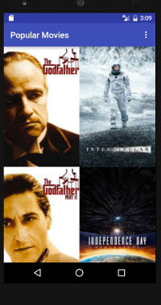
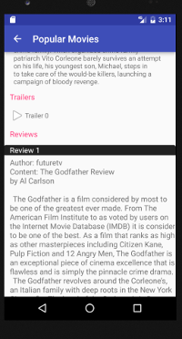
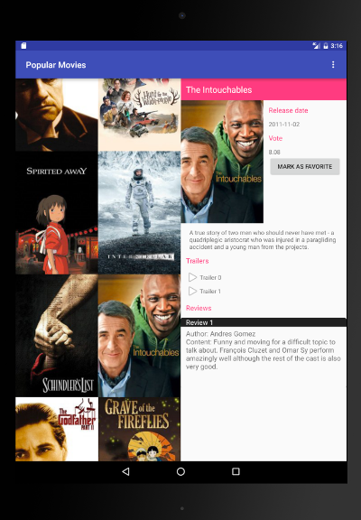

# Popular Movies Android App

### Screenshots
#### Phone

#### Tablet

#### API keys
API keys are stored in class AppKeys using public static variables. This class is not committed in the files on GitHub and needs to be created before code will run.

1. To access themoviedb.org database, add api key variable 'AppKeys.themoviedb'

