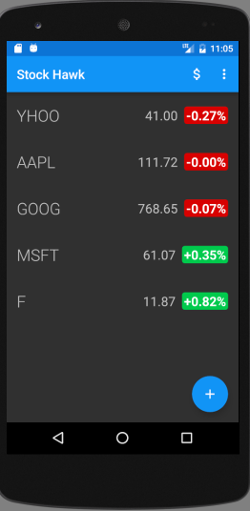
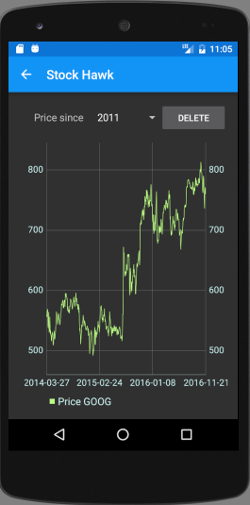
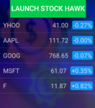

# Stockhawk Android App

## Requirements
### API keys
StockDetailActivity uses Quandl.com API to fetch prices. A free account is required to run the activity. Use Quandl.com API key in place of 'AppKeys.quandlKey' in StockDetailActivity or create AppKeys java class with 'quandlKey' public static string such that 'AppKeys.quandlKey' is accessible to all classes.

### Screenshots
#### Main screen

#### Detail screen

#### Widget

